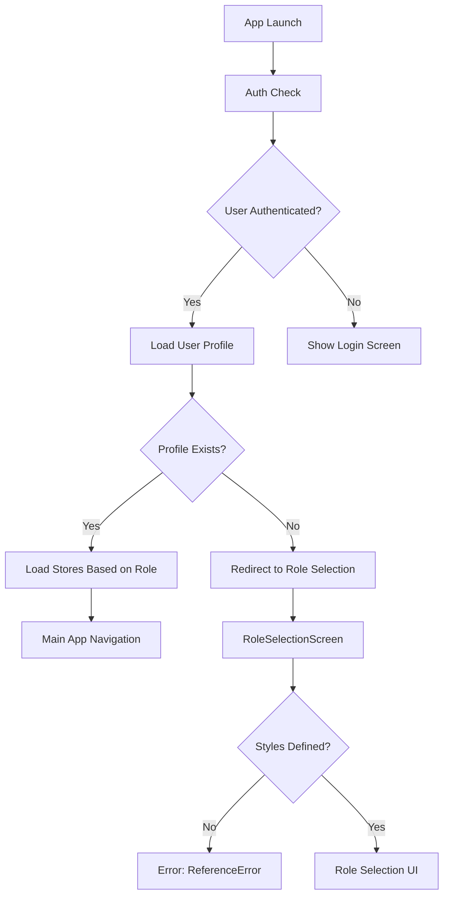

# Debugging App Errors - Design Document

## Overview

This document outlines the identified errors in the application and provides solutions to fix them. The main issues are:
1. Missing styles object in RoleSelectionScreen component causing a ReferenceError
2. Profile loading error with PGRST116 code indicating no rows returned from database query

## Error Analysis

### 1. RoleSelectionScreen Styles Error

**Error Message**: `ReferenceError: Property 'styles' doesn't exist`

**Root Cause**: The RoleSelectionScreen.js component references a `styles` object that is mentioned in a comment but never defined.

**Location**: `screens/RoleSelectionScreen.js`

**Impact**: The application crashes when trying to render the RoleSelectionScreen component.

### 2. Profile Loading Error

**Error Message**: `{"code": "PGRST116", "details": "The result contains 0 rows", "message": "Cannot coerce the result to a single JSON object"}`

**Root Cause**: The application is trying to fetch a user profile that doesn't exist in the database, causing the `.single()` query to fail.

**Location**: Multiple locations in the codebase where profile data is fetched:
- `App.js` in the `loadUserProfile` function
- `contexts/StoreContext.js` in the `loadUserProfile` function

**Impact**: Users may get stuck in authentication loops or be unable to access the application properly.

## Architecture



## Solutions

### 1. Fix RoleSelectionScreen Styles Issue

The RoleSelectionScreen component is missing its StyleSheet definition. We need to add the missing styles at the end of the file.

**Implementation**:
Add the following StyleSheet definition at the end of `screens/RoleSelectionScreen.js`:

```javascript
const styles = StyleSheet.create({
  container: {
    flex: 1,
    backgroundColor: '#f8fafc',
  },
  header: {
    alignItems: 'center',
    padding: 32,
    paddingTop: 64,
  },
  title: {
    fontSize: 24,
    fontWeight: 'bold',
    color: '#1e293b',
    marginTop: 16,
    marginBottom: 8,
  },
  subtitle: {
    fontSize: 16,
    color: '#64748b',
    textAlign: 'center',
  },
  rolesContainer: {
    paddingHorizontal: 24,
    paddingBottom: 32,
  },
  roleCard: {
    backgroundColor: 'white',
    borderRadius: 12,
    padding: 20,
    marginBottom: 16,
    shadowColor: '#000',
    shadowOffset: {
      width: 0,
      height: 2,
    },
    shadowOpacity: 0.1,
    shadowRadius: 3.84,
    elevation: 5,
  },
  selectedRoleCard: {
    borderColor: '#2563eb',
    borderWidth: 2,
  },
  roleHeader: {
    flexDirection: 'row',
    alignItems: 'flex-start',
    marginBottom: 16,
  },
  roleInfo: {
    flex: 1,
    marginLeft: 16,
  },
  roleTitle: {
    fontSize: 18,
    fontWeight: '600',
    color: '#334155',
    marginBottom: 4,
  },
  selectedRoleTitle: {
    color: '#2563eb',
  },
  roleDescription: {
    fontSize: 14,
    color: '#64748b',
  },
  featuresList: {
    borderTopWidth: 1,
    borderTopColor: '#e2e8f0',
    paddingTop: 16,
  },
  featureItem: {
    flexDirection: 'row',
    alignItems: 'center',
    marginBottom: 8,
  },
  featureText: {
    fontSize: 14,
    color: '#475569',
    marginLeft: 8,
  },
  loadingOverlay: {
    ...StyleSheet.absoluteFillObject,
    backgroundColor: 'rgba(255, 255, 255, 0.8)',
    justifyContent: 'center',
    alignItems: 'center',
    borderRadius: 10,
  },
  footer: {
    alignItems: 'center',
    padding: 24,
    paddingTop: 0,
  },
  footerText: {
    fontSize: 14,
    color: '#94a3b8',
    textAlign: 'center',
  },
});
```

### 2. Fix Profile Loading Error

The PGRST116 error occurs when a `.single()` query returns no rows. We need to modify the profile loading logic to handle cases where a user profile doesn't exist yet.

**Implementation**:

In `App.js`, modify the `loadUserProfile` function to use `.maybeSingle()` instead of `.single()`:

```javascript
const loadUserProfile = async (userId) => {
  try {
    console.log('🔍 Loading user profile for:', userId);
    
    // Try to get cached profile first
    const cachedProfile = await AsyncStorage.getItem(`user_profile_${userId}`);
    if (cachedProfile) {
      console.log('✅ Using cached profile:', JSON.parse(cachedProfile));
      return JSON.parse(cachedProfile);
    }
    
    // If online, try to fetch from database
    if (offlineManager.isConnected()) {
      console.log('🌐 Attempting to fetch profile from database');
      const { data: profile, error } = await supabase
        .from('profiles')
        .select('*')
        .eq('user_id', userId)
        .maybeSingle();
      
      if (error) {
        console.error('❌ Database error when fetching profile:', {
          code: error.code,
          details: error.details,
          message: error.message,
          userId: userId
        });
        throw error;
      }
      
      if (!profile) {
        console.log('ℹ️ No profile found for user, returning null');
        return null;
      }
      
      // Cache the profile if it exists
      await AsyncStorage.setItem(`user_profile_${userId}`, JSON.stringify(profile));
      return profile;
      
      // Return null if no profile exists
      return null;
    }
    
    // If offline and no cached profile, return null
    console.log('⚠️ Offline with no cached profile available');
    return null;
  } catch (error) {
    console.error('❌ Critical error in loadUserProfile:', {
      message: error.message,
      stack: error.stack,
      userId: userId
    });
    return null;
  }
};
```

Similarly, in `contexts/StoreContext.js`, modify the profile loading logic:

```javascript
// Get user profile
const { data: profile, error: profileError } = await supabase
  .from('profiles')
  .select('role, store_id')
  .eq('user_id', user.id)
  .maybeSingle(); // Changed from single() to maybeSingle()

if (profileError) {
  console.error('❌ StoreContext: Error fetching profile:', profileError);
  throw profileError;
}

// Handle case where profile doesn't exist yet
if (!profile) {
  console.log('🔍 StoreContext: No profile found for user');
  setUserRole(null);
  setStores([]);
  setSelectedStore(null);
  return;
}

console.log('🔍 StoreContext: Profile loaded:', profile);
setUserRole(profile.role);
```

## Testing

### Unit Tests

1. **RoleSelectionScreen Styles Test**
   - Verify that the styles object is properly defined
   - Check that all referenced style properties exist
   - Confirm that the component renders without style errors

2. **Profile Loading Test**
   - Test the `loadUserProfile` function with a user ID that has no profile
   - Verify that `maybeSingle()` properly handles empty results
   - Confirm that the function returns null when no profile exists
   - Test that existing profiles are still loaded correctly

### Integration Tests

1. **Authentication Flow Test**
   - Test the complete flow from login to profile creation
   - Verify that users without profiles are directed to RoleSelectionScreen
   - Confirm that users with profiles proceed to the main app

2. **Role Selection Test**
   - Test role selection for new users
   - Verify that profiles are created correctly in the database
   - Confirm that the UI renders properly with the new styles

## Error Handling Improvements

### Enhanced Error Logging

Add more detailed error logging to help with debugging:

```
// In App.js
const loadUserProfile = async (userId) => {
  try {
    console.log('🔍 Loading user profile for:', userId);
    
    // Try to get cached profile first
    const cachedProfile = await AsyncStorage.getItem(`user_profile_${userId}`);
    if (cachedProfile) {
      console.log('✅ Using cached profile:', JSON.parse(cachedProfile));
      return JSON.parse(cachedProfile);
    }
    
    // If online, try to fetch from database
    if (offlineManager.isConnected()) {
      console.log('🌐 Attempting to fetch profile from database');
      const { data: profile, error } = await supabase
        .from('profiles')
        .select('*')
        .eq('user_id', userId)
        .maybeSingle();
      
      if (error) {
        console.error('❌ Database error when fetching profile:', {
          code: error.code,
          details: error.details,
          message: error.message,
          userId: userId
        });
        throw error;
      }
      
      if (!profile) {
        console.log('ℹ️ No profile found for user, returning null');
        return null;
      }
      
      // Cache the profile if it exists
      await AsyncStorage.setItem(`user_profile_${userId}`, JSON.stringify(profile));
      return profile;
      
      // Return null if no profile exists
      return null;
    }
    
    // If offline and no cached profile, return null
    console.log('⚠️ Offline with no cached profile available');
    return null;
  } catch (error) {
    console.error('❌ Critical error in loadUserProfile:', {
      message: error.message,
      stack: error.stack,
      userId: userId
    });
    return null;
  }
};
```

## Performance Considerations

1. **Caching Strategy**: The existing caching strategy using AsyncStorage should be maintained to improve performance and support offline functionality.

2. **Network Resilience**: The `maybeSingle()` approach is more resilient to network issues and database inconsistencies than `single()`.

3. **UI Responsiveness**: The added styles will improve the visual appearance and user experience of the RoleSelectionScreen.

## Security Considerations

1. **Data Validation**: Ensure that all profile data is properly validated before being stored in the database.

2. **Error Information**: Avoid exposing sensitive information in error messages that could be visible to users.

3. **Authentication Checks**: Maintain proper authentication checks before allowing profile modifications.
