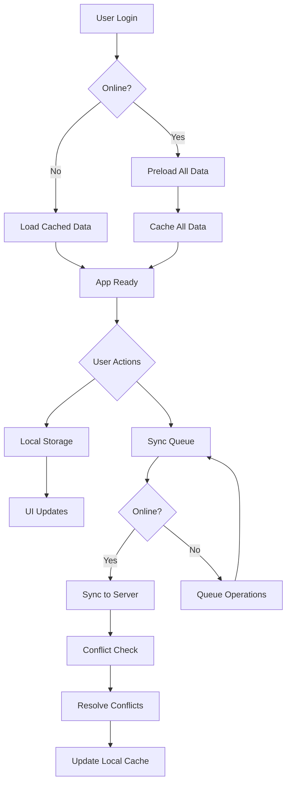

# Offline-Online Sync Implementation Design

## 1. Overview

This document outlines the design for implementing comprehensive offline-online synchronization functionality in the Financial Dashboard App. The solution will enable users to seamlessly work with the application regardless of network connectivity, with automatic synchronization when connectivity is restored.

### Goals
- Preload all required data on login for instant page navigation
- Enable full offline functionality with local data persistence
- Implement automatic background synchronization when online
- Handle data conflicts with appropriate resolution strategies
- Maintain data consistency across devices and sessions

## 2. Architecture

The implementation will enhance the existing offline-first architecture with improved data preloading and synchronization mechanisms.

### Key Components
1. **Data Preloader** - Handles initial data loading on login
2. **Enhanced OfflineManager** - Manages synchronization queue and conflict resolution
3. **Persistent Storage Layer** - Stores data locally using AsyncStorage
4. **Sync Engine** - Coordinates synchronization between local and remote data
5. **Conflict Resolver** - Handles data conflicts with timestamp-based resolution

### Data Flow


## 3. API Endpoints Reference

The synchronization mechanism will work with the existing Supabase backend through the following API endpoints:

### Authentication Endpoints
- `POST /auth/v1/token?grant_type=password` - User login
- `GET /auth/v1/user` - Get current user
- `POST /auth/v1/logout` - User logout

### Data Endpoints
- `GET /rest/v1/inventory` - Fetch inventory items
- `POST /rest/v1/inventory` - Create inventory item
- `PATCH /rest/v1/inventory?id=eq.{id}` - Update inventory item
- `DELETE /rest/v1/inventory?id=eq.{id}` - Delete inventory item

- `GET /rest/v1/sales` - Fetch sales records
- `POST /rest/v1/sales` - Create sales record
- `GET /rest/v1/sale_items` - Fetch sale items
- `POST /rest/v1/sale_items` - Create sale items

- `GET /rest/v1/expenses` - Fetch expense records
- `POST /rest/v1/expenses` - Create expense record
- `DELETE /rest/v1/expenses?id=eq.{id}` - Delete expense record

### Request/Response Schema

#### Inventory Item
```json
{
  "id": "string",
  "name": "string",
  "description": "string",
  "quantity": "number",
  "unit_price": "number",
  "cost_price": "number",
  "store_id": "string",
  "user_id": "string",
  "created_at": "string",
  "updated_at": "string"
}
```

#### Sale Record
```json
{
  "id": "string",
  "sale_number": "string",
  "customer_name": "string",
  "customer_email": "string",
  "customer_phone": "string",
  "subtotal": "number",
  "tax_amount": "number",
  "discount_amount": "number",
  "total_amount": "number",
  "payment_method": "string",
  "payment_status": "string",
  "store_id": "string",
  "user_id": "string",
  "created_at": "string",
  "updated_at": "string"
}
```

#### Sale Item
```json
{
  "id": "string",
  "sale_id": "string",
  "inventory_id": "string",
  "item_name": "string",
  "quantity": "number",
  "unit_price": "number",
  "line_total": "number",
  "user_id": "string",
  "created_at": "string"
}
```

#### Expense Record
```json
{
  "id": "string",
  "title": "string",
  "description": "string",
  "amount": "number",
  "expense_date": "string",
  "category": "string",
  "store_id": "string",
  "user_id": "string",
  "created_at": "string",
  "updated_at": "string"
}
```

### Authentication Requirements
- All API requests require a valid JWT token
- Tokens are refreshed automatically when expired
- Offline mode uses cached authentication data
- Role-based access control enforced on both client and server

## 4. Data Models & ORM Mapping

### Local Storage Schema
```javascript
// User Profile
{
  id: 'user_id',
  email: 'user@example.com',
  role: 'owner|worker|individual',
  store_id: 'store_id_if_worker',
  updated_at: 'ISO_TIMESTAMP'
}

// Store Data
{
  id: 'store_id',
  name: 'Store Name',
  owner_id: 'user_id',
  description: 'Store Description',
  address: 'Store Address',
  updated_at: 'ISO_TIMESTAMP'
}

// Inventory Item
{
  id: 'item_id',
  name: 'Item Name',
  description: 'Item Description',
  quantity: 10,
  unit_price: 9.99,
  cost_price: 5.00,
  store_id: 'store_id',
  user_id: 'user_id_if_individual',
  is_offline: true|false,
  offline_id: 'temp_id_if_offline',
  updated_at: 'ISO_TIMESTAMP'
}

// Sale Record
{
  id: 'sale_id',
  sale_number: 'SALE-001',
  customer_name: 'Customer Name',
  total_amount: 99.99,
  store_id: 'store_id',
  user_id: 'user_id',
  is_offline: true|false,
  offline_id: 'temp_id_if_offline',
  created_at: 'ISO_TIMESTAMP',
  updated_at: 'ISO_TIMESTAMP',
  sale_items: [
    {
      inventory_id: 'item_id',
      quantity: 2,
      unit_price: 29.99
    }
  ]
}
```

### ORM Mapping
The local storage schema maps to the Supabase database tables as follows:

| Local Storage | Supabase Table | Key Mapping |
|---------------|----------------|-------------|
| User Profile | profiles | id → user_id |
| Store Data | stores | id → id |
| Inventory Item | inventory | id → id |
| Sale Record | sales | id → id |
| Sale Item | sale_items | id → id |
| Expense Record | expenses | id → id |

## 5. Business Logic Layer

### Data Preloading Logic
Upon successful login, the application will preload data for all screens to ensure instant navigation:

#### Data to Preload
- User profile and role information
- Store information (for owners and workers)
- Complete inventory data
- Sales history
- Expense records
- Dashboard metrics and charts data

#### Implementation Approach
```javascript
// In App.js or a dedicated preloader service
const preloadAllData = async (userId, userRole, storeId) => {
  try {
    // Preload user profile
    await offlineDataService.getUserProfile(userId);
    
    // Preload stores (for owners/workers)
    if (userRole !== 'individual') {
      await offlineDataService.getStores(userId, userRole);
    }
    
    // Preload inventory
    await offlineDataService.getInventory(storeId, userId, userRole);
    
    // Preload sales
    await offlineDataService.getSales(storeId, userId, userRole);
    
    // Preload expenses
    await offlineDataService.getExpenses(storeId, userId, userRole);
    
    // Preload dashboard data
    await preloadDashboardData(userId, userRole, storeId);
    
    console.log('✅ All data preloaded successfully');
  } catch (error) {
    console.error('Error preloading data:', error);
    // Fallback to cached data if available
  }
};
```

### Preloading Service
A dedicated service will handle the initial data preloading:

```javascript
class DataPreloader {
  constructor(offlineDataService, offlineManager) {
    this.offlineDataService = offlineDataService;
    this.offlineManager = offlineManager;
  }
  
  async preloadAll(userData) {
    const { userId, userRole, storeId } = userData;
    const preloadTasks = [];
    
    // Define all preload tasks
    preloadTasks.push(() => this.offlineDataService.getUserProfile(userId));
    
    if (userRole !== 'individual') {
      preloadTasks.push(() => this.offlineDataService.getStores(userId, userRole));
    }
    
    preloadTasks.push(() => this.offlineDataService.getInventory(storeId, userId, userRole));
    preloadTasks.push(() => this.offlineDataService.getSales(storeId, userId, userRole));
    preloadTasks.push(() => this.offlineDataService.getExpenses(storeId, userId, userRole));
    preloadTasks.push(() => this.preloadDashboardData(userId, userRole, storeId));
    
    // Execute all preload tasks in parallel
    try {
      await Promise.all(preloadTasks.map(task => task()));
      console.log('✅ All data preloaded successfully');
      return true;
    } catch (error) {
      console.error('Error during preloading:', error);
      return false;
    }
  }
  
  async preloadDashboardData(userId, userRole, storeId) {
    // Preload dashboard-specific data
    // Implementation details...
  }
}
```

### Enhanced Offline Manager
The OfflineManager will be enhanced with additional features:

```javascript
class EnhancedOfflineManager extends OfflineManager {
  constructor() {
    super();
    this.preloadedData = new Map();
    this.syncInProgress = false;
  }
  
  async storePreloadedData(key, data) {
    this.preloadedData.set(key, data);
    // Also store in persistent storage
    await this.storeLocalData(key, data);
  }
  
  getPreloadedData(key) {
    return this.preloadedData.get(key);
  }
  
  async syncWithConflictResolution() {
    if (this.syncInProgress) {
      console.log('Sync already in progress, skipping...');
      return;
    }
    
    this.syncInProgress = true;
    
    try {
      await this.syncPendingChanges();
    } finally {
      this.syncInProgress = false;
    }
  }
  
  async requeueWithBackoff(item) {
    item.attempts = (item.attempts || 0) + 1;
    
    // Exponential backoff: 1s, 2s, 4s, 8s, max 30s
    const delay = Math.min(1000 * Math.pow(2, item.attempts - 1), 30000);
    
    setTimeout(() => {
      this.syncQueue.push(item);
      if (this.isOnline) {
        this.syncWithConflictResolution();
      }
    }, delay);
  }
}
```

## 6. Middleware & Interceptors

### Network Interceptor
A network interceptor will monitor connectivity status and trigger sync operations:

```javascript
// Network interceptor in OfflineManager
class NetworkInterceptor {
  constructor(offlineManager) {
    this.offlineManager = offlineManager;
    this.init();
  }
  
  init() {
    // Listen for network changes
    const unsubscribe = NetInfo.addEventListener(state => {
      console.log('🌐 Network status changed:', state);
      const wasOffline = !this.offlineManager.isOnline;
      this.offlineManager.isOnline = state.isConnected;
      
      if (wasOffline && this.offlineManager.isOnline) {
        console.log('✅ Back online - processing sync queue');
        this.offlineManager.syncWithConflictResolution();
      } else if (!this.offlineManager.isOnline) {
        console.log('⚠️ Offline mode activated');
      }
      
      this.offlineManager.notifyListeners();
    });
    
    return unsubscribe;
  }
}
```

### Request Interceptor
A request interceptor will handle offline requests by queuing them:

```javascript
// Request interceptor
const requestInterceptor = async (requestConfig) => {
  // Check if online
  if (offlineManager.isConnected()) {
    return requestConfig; // Proceed with request
  }
  
  // Queue request for later
  const operationKey = `queued_request_${Date.now()}`;
  const syncFunction = async () => {
    // Re-execute the original request
    // Implementation depends on specific API client
  };
  
  offlineManager.addToSyncQueue(operationKey, requestConfig, syncFunction);
  throw new Error('OFFLINE_MODE'); // Prevent request from proceeding
};
```

## 7. Testing Strategy

### Unit Tests
1. Test data preloading functionality
2. Verify offline data persistence
3. Test sync queue management
4. Validate conflict resolution logic
5. Test error handling and recovery

### Integration Tests
1. Full offline workflow simulation
2. Sync process with various conflict scenarios
3. Data consistency across sessions
4. Performance testing with large datasets

### Test Cases
```javascript
// Example test cases
describe('OfflineOnlineSync', () => {
  test('should preload all required data on login', async () => {
    // Implementation
  });
  
  test('should store data locally when offline', async () => {
    // Implementation
  });
  
  test('should sync data when back online', async () => {
    // Implementation
  });
  
  test('should resolve conflicts with timestamp-based strategy', async () => {
    // Implementation
  });
  
  test('should handle sync failures with retry logic', async () => {
    // Implementation
  });
});
```

### Offline Testing Scenarios
1. User logs in while offline - should load cached data
2. User performs actions while offline - should queue operations
3. User goes online - should sync all queued operations
4. Network interruption during sync - should resume sync
5. Conflicting changes - should resolve based on timestamps
6. Large data sets - should handle efficiently
7. App restart during offline work - should preserve data
8. Multiple devices with same user - should sync correctly

## 8. Performance Considerations

### Memory Management
- Implement data pagination for large datasets
- Use efficient caching strategies
- Clean up old cached data periodically

### Network Optimization
- Batch multiple operations when possible
- Compress data for transfer
- Implement request prioritization

### Storage Optimization
- Use efficient data serialization
- Implement data compression for large objects
- Regular cleanup of obsolete cached data

## 9. Security Considerations

### Data Encryption
- Encrypt sensitive data in local storage
- Use secure key management
- Implement data integrity checks

### Access Control
- Maintain role-based access in offline mode
- Validate permissions before allowing operations
- Securely store authentication tokens

## 10. Error Handling & Recovery

### Error Categories
1. Network errors
2. Data conflicts
3. Storage errors
4. Authentication errors

### Recovery Strategies
1. Automatic retry with exponential backoff
2. Manual sync trigger for persistent errors
3. Data rollback for failed operations
4. User notification for critical errors


