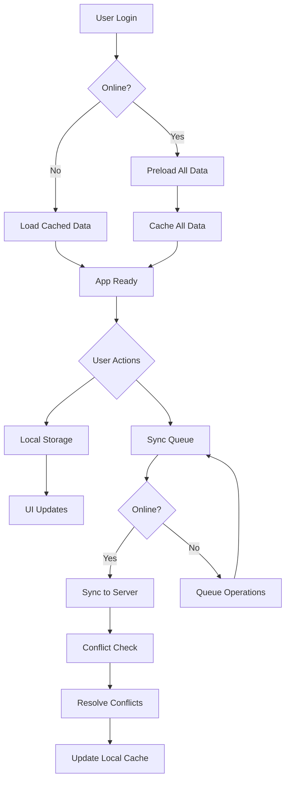

# Offline-Online Sync Implementation Design

## 1. Overview

This document outlines the design for implementing comprehensive offline-online synchronization functionality in the Financial Dashboard App. The solution will enable users to seamlessly work with the application regardless of network connectivity, with automatic synchronization when connectivity is restored.

### Goals
- Preload all required data on login for instant page navigation
- Enable full offline functionality with local data persistence
- Implement automatic background synchronization when online
- Handle data conflicts with appropriate resolution strategies
- Maintain data consistency across devices and sessions

## 2. Architecture

The implementation will enhance the existing offline-first architecture with improved data preloading and synchronization mechanisms.

### Key Components
1. **Data Preloader** - Handles initial data loading on login
2. **Enhanced OfflineManager** - Manages synchronization queue and conflict resolution
3. **Persistent Storage Layer** - Stores data locally using AsyncStorage
4. **Sync Engine** - Coordinates synchronization between local and remote data
5. **Conflict Resolver** - Handles data conflicts with timestamp-based resolution

### Data Flow


## 3. Initial Data Preloading

### Preloading Strategy
Upon successful login, the application will preload data for all screens to ensure instant navigation:

#### Data to Preload
- User profile and role information
- Store information (for owners and workers)
- Complete inventory data
- Sales history
- Expense records
- Dashboard metrics and charts data

### Implementation Approach
```javascript
// In App.js or a dedicated preloader service
const preloadAllData = async (userId, userRole, storeId) => {
  try {
    // Preload user profile
    await offlineDataService.getUserProfile(userId);
    
    // Preload stores (for owners/workers)
    if (userRole !== 'individual') {
      await offlineDataService.getStores(userId, userRole);
    }
    
    // Preload inventory
    await offlineDataService.getInventory(storeId, userId, userRole);
    
    // Preload sales
    await offlineDataService.getSales(storeId, userId, userRole);
    
    // Preload expenses
    await offlineDataService.getExpenses(storeId, userId, userRole);
    
    // Preload dashboard data
    await preloadDashboardData(userId, userRole, storeId);
    
    console.log('✅ All data preloaded successfully');
  } catch (error) {
    console.error('Error preloading data:', error);
    // Fallback to cached data if available
  }
};
```

## 4. Offline Functionality

### Persistent Storage
The application will use AsyncStorage to store all data locally with the following structure:

#### Storage Keys
- `user_profile_${userId}` - User profile information
- `stores_${userId}` - Store information
- `inventory_${storeId}_${userRole}` - Inventory data
- `sales_${storeId}_${userRole}` - Sales data
- `expenses_${storeId}_${userRole}` - Expense data
- `dashboard_${userId}` - Dashboard metrics
- `sync_queue` - Pending synchronization operations

### Data Access Pattern
```javascript
// Enhanced OfflineDataService with preloading awareness
class OfflineDataService {
  async getInventory(storeId, userId, userRole) {
    const cacheKey = `inventory_${storeId || userId}_${userRole}`;
    
    // Check if data is already preloaded
    const preloadedData = this.preloadedData.get(cacheKey);
    if (preloadedData) {
      return preloadedData;
    }
    
    // Standard cache/database access
    if (offlineManager.isConnected()) {
      // Fetch from server and cache
      // ... existing implementation
    } else {
      // Return cached data
      // ... existing implementation
    }
  }
}
```

## 5. Synchronization Engine

### Sync Queue Management
The OfflineManager will be enhanced to handle synchronization with improved queue management:

#### Queue Structure
```javascript
// Enhanced sync queue in OfflineManager
this.syncQueue = [
  {
    id: 'unique_operation_id',
    type: 'add_inventory|update_inventory|delete_inventory|add_sale|add_expense',
    data: { /* operation data */ },
    timestamp: 'ISO_TIMESTAMP',
    attempts: 0,
    syncFunction: () => {},
    rollbackFunction: () => {}
  }
];
```

### Automatic Sync Trigger
```javascript
// In OfflineManager
async syncPendingChanges() {
  if (!this.isOnline || this.syncQueue.length === 0) return;

  console.log(`🔄 Syncing ${this.syncQueue.length} pending changes...`);
  
  // Sort queue by timestamp to maintain order
  const queue = [...this.syncQueue].sort((a, b) => 
    new Date(a.timestamp) - new Date(b.timestamp)
  );
  this.syncQueue = [];

  for (const item of queue) {
    try {
      await this.executeSyncOperation(item);
      console.log(`✅ Synced: ${item.id}`);
    } catch (error) {
      console.error(`❌ Sync failed for ${item.id}:`, error);
      // Re-add to queue with exponential backoff
      this.requeueWithBackoff(item);
    }
  }
}

async executeSyncOperation(operation) {
  // Execute with transaction support
  const transactionId = `sync_${operation.id}_${Date.now()}`;
  await offlineManager.beginTransaction(transactionId);
  
  try {
    const result = await operation.syncFunction();
    await offlineManager.commitTransaction(transactionId);
    return result;
  } catch (error) {
    await offlineManager.rollbackTransaction(transactionId);
    throw error;
  }
}
```

## 6. Conflict Resolution

### Conflict Detection
Conflicts will be detected by comparing timestamps of local and server data:

#### Resolution Strategy
1. **Timestamp-based resolution** - Most recent change wins
2. **User intervention** - For critical conflicts requiring user decision
3. **Merge strategies** - For compatible data that can be combined

### Implementation
```javascript
// Conflict resolution in sync operations
async resolveConflicts(localData, serverData) {
  // Simple timestamp-based resolution
  const localTimestamp = new Date(localData.updated_at || localData.created_at);
  const serverTimestamp = new Date(serverData.updated_at || serverData.created_at);
  
  if (localTimestamp > serverTimestamp) {
    // Local is newer, update server
    return { resolution: 'update_server', data: localData };
  } else if (serverTimestamp > localTimestamp) {
    // Server is newer, update local
    return { resolution: 'update_local', data: serverData };
  } else {
    // Same timestamp, check content
    return { resolution: 'no_conflict', data: localData };
  }
}
```

## 7. Data Models & Storage Schema

### Local Storage Schema
```javascript
// User Profile
{
  id: 'user_id',
  email: 'user@example.com',
  role: 'owner|worker|individual',
  store_id: 'store_id_if_worker',
  updated_at: 'ISO_TIMESTAMP'
}

// Store Data
{
  id: 'store_id',
  name: 'Store Name',
  owner_id: 'user_id',
  description: 'Store Description',
  address: 'Store Address',
  updated_at: 'ISO_TIMESTAMP'
}

// Inventory Item
{
  id: 'item_id',
  name: 'Item Name',
  description: 'Item Description',
  quantity: 10,
  unit_price: 9.99,
  cost_price: 5.00,
  store_id: 'store_id',
  user_id: 'user_id_if_individual',
  is_offline: true|false,
  offline_id: 'temp_id_if_offline',
  updated_at: 'ISO_TIMESTAMP'
}

// Sale Record
{
  id: 'sale_id',
  sale_number: 'SALE-001',
  customer_name: 'Customer Name',
  total_amount: 99.99,
  store_id: 'store_id',
  user_id: 'user_id',
  is_offline: true|false,
  offline_id: 'temp_id_if_offline',
  created_at: 'ISO_TIMESTAMP',
  updated_at: 'ISO_TIMESTAMP',
  sale_items: [
    {
      inventory_id: 'item_id',
      quantity: 2,
      unit_price: 29.99
    }
  ]
}
```

## 8. Business Logic Layer

### Preloading Service
A dedicated service will handle the initial data preloading:

```javascript
class DataPreloader {
  constructor(offlineDataService, offlineManager) {
    this.offlineDataService = offlineDataService;
    this.offlineManager = offlineManager;
  }
  
  async preloadAll(userData) {
    const { userId, userRole, storeId } = userData;
    const preloadTasks = [];
    
    // Define all preload tasks
    preloadTasks.push(() => this.offlineDataService.getUserProfile(userId));
    
    if (userRole !== 'individual') {
      preloadTasks.push(() => this.offlineDataService.getStores(userId, userRole));
    }
    
    preloadTasks.push(() => this.offlineDataService.getInventory(storeId, userId, userRole));
    preloadTasks.push(() => this.offlineDataService.getSales(storeId, userId, userRole));
    preloadTasks.push(() => this.offlineDataService.getExpenses(storeId, userId, userRole));
    preloadTasks.push(() => this.preloadDashboardData(userId, userRole, storeId));
    
    // Execute all preload tasks in parallel
    try {
      await Promise.all(preloadTasks.map(task => task()));
      console.log('✅ All data preloaded successfully');
      return true;
    } catch (error) {
      console.error('Error during preloading:', error);
      return false;
    }
  }
  
  async preloadDashboardData(userId, userRole, storeId) {
    // Preload dashboard-specific data
    // Implementation details...
  }
}
```

### Enhanced Offline Manager
The OfflineManager will be enhanced with additional features:

```javascript
class EnhancedOfflineManager extends OfflineManager {
  constructor() {
    super();
    this.preloadedData = new Map();
    this.syncInProgress = false;
  }
  
  async storePreloadedData(key, data) {
    this.preloadedData.set(key, data);
    // Also store in persistent storage
    await this.storeLocalData(key, data);
  }
  
  getPreloadedData(key) {
    return this.preloadedData.get(key);
  }
  
  async syncWithConflictResolution() {
    if (this.syncInProgress) {
      console.log('Sync already in progress, skipping...');
      return;
    }
    
    this.syncInProgress = true;
    
    try {
      await this.syncPendingChanges();
    } finally {
      this.syncInProgress = false;
    }
  }
  
  async requeueWithBackoff(item) {
    item.attempts = (item.attempts || 0) + 1;
    
    // Exponential backoff: 1s, 2s, 4s, 8s, max 30s
    const delay = Math.min(1000 * Math.pow(2, item.attempts - 1), 30000);
    
    setTimeout(() => {
      this.syncQueue.push(item);
      if (this.isOnline) {
        this.syncWithConflictResolution();
      }
    }, delay);
  }
}
```

## 9. UI/UX Considerations

### Offline Indicator
Enhance the offline indicator to show sync status:

```javascript
// Enhanced OfflineIndicator component
const OfflineIndicator = () => {
  const isOnline = offlineManager.isConnected();
  const pendingSync = offlineManager.getSyncStatus().pendingSync;
  
  return (
    <View style={styles.indicator}>
      {!isOnline && (
        <View style={[styles.status, styles.offline]}>
          <MaterialIcons name="cloud-off" size={16} color="white" />
          <Text style={styles.statusText}>Offline</Text>
        </View>
      )}
      {pendingSync > 0 && (
        <View style={[styles.status, styles.syncing]}>
          <MaterialIcons name="sync" size={16} color="white" />
          <Text style={styles.statusText}>Syncing ({pendingSync})</Text>
        </View>
      )}
    </View>
  );
};
```

### User Feedback
Provide clear feedback during sync operations:

1. Show sync progress in the UI
2. Notify users of successful sync completion
3. Alert users to any sync conflicts that require attention
4. Indicate when all data has been preloaded

## 10. Testing Strategy

### Unit Tests
1. Test data preloading functionality
2. Verify offline data persistence
3. Test sync queue management
4. Validate conflict resolution logic
5. Test error handling and recovery

### Integration Tests
1. Full offline workflow simulation
2. Sync process with various conflict scenarios
3. Data consistency across sessions
4. Performance testing with large datasets

### Test Cases
```javascript
// Example test cases
describe('OfflineOnlineSync', () => {
  test('should preload all required data on login', async () => {
    // Implementation
  });
  
  test('should store data locally when offline', async () => {
    // Implementation
  });
  
  test('should sync data when back online', async () => {
    // Implementation
  });
  
  test('should resolve conflicts with timestamp-based strategy', async () => {
    // Implementation
  });
  
  test('should handle sync failures with retry logic', async () => {
    // Implementation
  });
});
```

## 11. Performance Considerations

### Memory Management
- Implement data pagination for large datasets
- Use efficient caching strategies
- Clean up old cached data periodically

### Network Optimization
- Batch multiple operations when possible
- Compress data for transfer
- Implement request prioritization

### Storage Optimization
- Use efficient data serialization
- Implement data compression for large objects
- Regular cleanup of obsolete cached data

## 12. Security Considerations

### Data Encryption
- Encrypt sensitive data in local storage
- Use secure key management
- Implement data integrity checks

### Access Control
- Maintain role-based access in offline mode
- Validate permissions before allowing operations
- Securely store authentication tokens

## 13. Error Handling & Recovery

### Error Categories
1. Network errors
2. Data conflicts
3. Storage errors
4. Authentication errors

### Recovery Strategies
1. Automatic retry with exponential backoff
2. Manual sync trigger for persistent errors
3. Data rollback for failed operations
4. User notification for critical errors